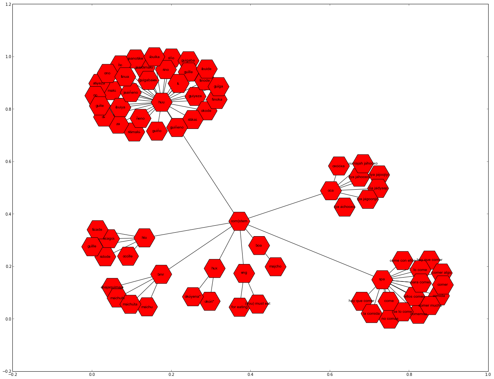

Translation Graphs from GrAF/XML files
======================================

In this tutorial we will demonstrate how to extract a translation graph
from data in digitized dictionaries. The translation graph connects
entries in dictionaries, via annotation for "heads" and "translations"
within the dictionary. We will demonstrate how to visualize this data
with a plotting library and how to export parts of the graph to JSON for
interactive visualizations in the web.

You can download this tutorial as IPython notebook here:

https://github.com/cidles/graf-python/blob/master/examples/Translation%20Graph%20from%20GrAF.ipynb

Or as a Python script here:

https://github.com/cidles/graf-python/blob/master/examples/Translation%20Graph%20from%20GrAF.py

Data
----

For this tutorial we will use data from the project "`Quantitative
Historical Linguistics <http://www.quanthistling.info/>`_\ ". The
website of the project provides a ZIP package of GrAF/XML files for the
printed sources that were digitized within the project:

http://www.quanthistling.info/data/downloads/xml/data.zip

The ZIP package contains several files encoded as described in the `ISO
standard
24612 <http://www.iso.org/iso/catalogue_detail.htm?csnumber=37326>`_
"Linguistic annotation framework (LAF)". The QuantHistLing data contains
dictionary and wordlist sources. Those were first tokenized into
entries, for each entry you will find annotations for at least the head
word(s) ("head" annotation) and translation(s) ("translation"
annotation) in the case of dictionaries. We will only use the
dictionaries of the "Witotoan" component in this tutorial. The ZIP
package also contains a CSV file "sources.csv" that contains some
information for each source, for example the languages as ISO codes,
type of source, etc. Be aware that the ZIP package contains a filtered
version of the sources: only entries that contain a Spanish stem that is
included in the `Spanish swadesh
list <http://en.wiktionary.org/wiki/Appendix:Spanish_Swadesh_list>`_ are
included in the download package.

For a simple example how to parse one of the source please see here:

http://graf-python.readthedocs.org/en/latest/Querying%20GrAF%20graphs.html

What are translation graphs?
----------------------------

In our case, translation graphs are graphs that connect all spanish
translation with every head word that we find for each translation in
our sources. The idea is that spanish is some kind of interlingua in our
case: if a string of a spanish translation in one source matches a
string in another source this will only be '''one''' node in our graph.
For the head words, this is not the case: matching strings in head words
in different source are different nodes in the graph. This holds even if
the different sources describe the same language, as different sources
will use different orthographies.

To fullfil that need, head words are internally represented as a string
with two parts: the head word and its source. Both parts are seperated
by a pipe symbol "\|". For example, in a `DOT
file <http://en.wikipedia.org/wiki/DOT_language>`_ such a node looks
like this:

    "ócáji\|thiesen1998" [lang=boa, source=thiesen1998\_25\_339];

The square brackets contain additional attributes here. These attributes
are not part of the node's name, they contain just additonal information
the user wants to store with the nodes.

In comparison, a spanish translation looks like this:

    "vaca" [lang=spa];

There is no attribute "source" here, as this translation might occur in
several sources. An edge connecting the two nodes looks like this:

    "vaca" -- "ócáji\|thiesen1998";

To handle such graphs our scripts use the `NetworkX Python
library <http://networkx.lanl.gov/>`_. It is kind of a standard in
scientific graph computing with Python (remark: I started with the
pygraph library, which has more or less the same API but by far not
enough operations to compute with graphs later).

Requirements
------------

The following Python libraries are required to process the GrAF/XML
files and create the translation graphs:

-  NetworkX: http://networkx.lanl.gov/
-  graf-python: https://github.com/cidles/graf-python
-  NLTK: http://nltk.org

To visualize the graphs you have to install matplotlib:

-  matplotlib: http://matplotlib.org/

When you have installed all the libraries you are able to import the
following modules:

In[22]:

.. code-block:: python

    import os
    import csv
    import codecs
    import re
    import glob
    
    import networkx
    import graf
    import nltk

Get Witotoan sources
--------------------

Change to the directory where you extracted the ZIP archive that you
downloaded from the QuantHistLing website:

In[2]:

.. code-block:: python

    os.chdir("h:/Corpora/qlc/graf")

Now we open the file "sources.csv" and read out all the sources that are
part of the component "Witotoan" and that are dictionaries. We will
store a list of those source in ``witotoan_sources``:

In[3]:

.. code-block:: python

    sources = csv.reader(open("sources.csv", "rU"), delimiter="\t")
    witotoan_sources = list()
    for source in sources:
        if source[5] == "Witotoan" and source[1] == "dictionary":
            witotoan_sources.append(source[0])

GrAF to NetworkX
----------------

Next we define a helper function that transform a GrAF graph into a
networkx graph. For this we traverse the graph by querying for all
entries. For each entry we look for connected nodes that have "head" or
"translation" annotation. All of those nodes that are Spanish are stored
in the list ``spa``. All non-Spanish annotations are stored in
``others``. In the end the collected annotation are added to the new
networkx graph, and each spanish node is connected to all the other
nodes for each entry:

In[51]:

.. code-block:: python

    def graf_to_networkx(graf, source = None):
        g = networkx.Graph()
        for (node_id, node) in graf.nodes.items():
            spa = list()
            others = dict()
            if node_id.endswith("entry"):
                for e in node.out_edges:
                    if e.annotations.get_first().label == "head" or e.annotations.get_first().label == "translation":
                        # get lang
                        for n in e.to_node.links[0][0].nodes:
                            if n.annotations.get_first().label == "iso-639-3":
                                if n.annotations.get_first().features.get_value("substring") == "spa":
                                    spa.append(e.to_node.annotations.get_first().features.get_value("substring"))
                                    break
                                else:
                                    others[e.to_node.annotations.get_first().features.get_value("substring")] = n.annotations.get_first().features.get_value("substring")
                                    break
            if len(spa) > 0:
                for head in spa:
                    g.add_node(head, attr_dict={ "lang": "spa" })
                    for translation in others:
                        g.add_node(u"{0}|{1}".format(translation, source), attr_dict={ "lang": others[translation], "source": source })
                        g.add_edge(head, u"{0}|{1}".format(translation, source))
        return g

Parse GrAF/XML files
--------------------

Now we parse all the XML files of the extracted ZIP package. For this we
traverse through all the directories that have a name in
\`witotoan\_sources'. The files we are looking for are the
"-dictinterpretation.xml" files within each directory, as those contain
the annotations for "heads" and "translations".

First we create an empty list ``graphs`` that will later store all the
networkx graphs:

In[52]:

.. code-block:: python

    parser = graf.GraphParser()
    graphs = []

Then we loop through all the Witotoan sources, parse the XML files and
transform the graphs into networkx graph by calling the helper function
that we defined above. We print a progress report within the loop, as
parsing and transformation might take some time:

In[53]:

.. code-block:: python

    for d in witotoan_sources:
        for f in glob.glob(os.path.join(d, "dict-*-dictinterpretation.xml")):
            print("Parsing {0}...".format(f))
            graf_graph = parser.parse(f)
            g = graf_to_networkx(graf_graph, d)
            graphs.append(g)
    print("OK")

.. parsed-literal::

    Parsing thiesen1998\dict-thiesen1998-25-339-dictinterpretation.xml...
    Parsing minor1987\dict-minor1987-1-126-dictinterpretation.xml...
    Parsing minor1971\dict-minor1971-3-74-dictinterpretation.xml...
    Parsing burtch1983\dict-burtch1983-19-262-dictinterpretation.xml...
    Parsing leach1969\dict-leach1969-67-161-dictinterpretation.xml...
    Parsing walton1997\dict-walton1997-9-120-dictinterpretation.xml...
    Parsing preuss1994\dict-preuss1994-797-912-dictinterpretation.xml...
    Parsing rivet1953\dict-rivet1953-336-377-dictinterpretation.xml...
    Parsing griffiths2001\dict-griffiths2001-79-199-dictinterpretation.xml...
    OK
    

Merge all graphs
----------------

Now we can merge all the individual graphs for each source into one big
graph. This will collapse all Spanish nodes and so connect the nodes
that have a common Spanish translation:

In[54]:

.. code-block:: python

    import copy
    combined_graph = copy.deepcopy(graphs[0])
    for gr in graphs[1:]:
        for node in gr:
            combined_graph.add_node(node, gr.node[node])
        for n1, n2 in gr.edges_iter():
            combined_graph.add_edge(n1, n2, gr.edge[n1][n2])

We count the nodes in the graph and the `number of connected
components <http://networkx.lanl.gov/reference/generated/networkx.algorithms.components.connected.number_connected_components.html#networkx.algorithms.components.connected.number_connected_components>`_
to get an impression how the graph "looks". The number of nodes is much
higher than the number of connected components, so we already have a lot
of the nodes connected in groups, either as a consequence from being
part of one dictionary entry or through the merge we did via the Spanish
node:

In[55]:

.. code-block:: python

    len(combined_graph.nodes())

Out[55]:

.. parsed-literal::

    73022

In[56]:

.. code-block:: python

    networkx.algorithms.components.number_connected_components(combined_graph)

Out[56]:

.. parsed-literal::

    17021

Connect nodes with the same stem
--------------------------------

The next step is to connect spanish translations that contain the same
stem. For this we first remove certain stop words from the translation
(list of stopwords from NLTK). There are two cases then: just one word
remains, or more than one word remains.

We have two options now what to do with the latter: either they are not
connected with anything at all (default behaviour), or each word is
stemmed and the translation is connected with every other translation
that contain the same stems. Right now this results in many connections
that look not very useful. This should be done in a more intelligent way
in the future (for example find heads of phrases in multiword expressions
and only connect those; split the weight of the connections between all
stems and work with weighted graphs from this step on; ...).

To connect the spanish translations the script adds additional "stem
nodes" to the graph. The name of these nodes consists of a spanish word
stem plus a pipe symbol plus the string "stem". These nodes look like
this in a dot file:

    "tom\|stem" [is\_stem=True];

The introduction of these nodes later facilites the output of
translation matrixes, as you can just search for stems within the graph
and only output direct neighbours with spanish translations. It would
also be possible to directly connect the spanish translations if they
have a matching stem, but then the graph traversal to find matching
translations and their heads is a bit more complex later.

First we create a stemmer object from the SpanishStemmer in NLTK:

In[57]:

.. code-block:: python

    from nltk.stem.snowball import SpanishStemmer
    stemmer = SpanishStemmer(True)

We create the list of stopwords and encode them as unicode strings:

In[58]:

.. code-block:: python

    combined_graph_stemmed = copy.deepcopy(combined_graph)
    stopwords = nltk.corpus.stopwords.words("spanish")
    stopwords = [w.decode("utf-8") for w in stopwords]

Then we loop through all the nodes of the merged graph and add the stem
nodes to each Spanish node. If the node has only one word (after
stopword removal) we will use the NLTK stemmer; otherwise we just leave
the phrase as it is:

In[59]:

.. code-block:: python

    combined_graph_stemmed = copy.deepcopy(combined_graph)
    for node in combined_graph.nodes():
        if "lang" in combined_graph.node[node] and combined_graph.node[node]["lang"] == "spa":
            e = re.sub(" ?\([^)]\)", "", node)
            e = e.strip()
            stem = e
            words = e.split(" ")
            if len(words) > 1:
                words = [w for w in words if not w in stopwords or w == ""]
            if len(words) == 1:
                stem = stemmer.stem(words[0])
                
            stem = stem + "|stem"
            combined_graph_stemmed.add_node(stem, is_stem=True)
            combined_graph_stemmed.add_edge(stem, node)

Again we can count the nodes and the number of connected components. We
see that the number of connected components decreases, as more nodes are
connected into groups now:

In[60]:

.. code-block:: python

    networkx.algorithms.components.number_connected_components(combined_graph_stemmed)

Out[60]:

.. parsed-literal::

    13944

In[61]:

.. code-block:: python

    len(combined_graph_stemmed.nodes())

Out[61]:

.. parsed-literal::

    100447

Export the merged graph as DOT
------------------------------

The graph may now be exported to the DOT format, to be used in other
tools for graph analysis or visualization. For this we use a helper
function from the `qlc library <https://github.com/pbouda/qlc>`_:

In[15]:

.. code-block:: python

    from qlc.translationgraph import read, write
    OUT = codecs.open("translation_graph_stemmed.dot", "w", "utf-8")
    OUT.write(write(combined_graph_stemmed))
    OUT.close()

Extract a subgraph for the stem of "comer"
------------------------------------------

As an example how to further process the graph we will extract the
subgraph for the stem "comer" now. For this the graph is traversed again
until the node "com\|stem" is found. All the neighbours of this node are
copied to a new graph. We will also remove the sources from the node
strings to make the final visualization more readable:

In[66]:

.. code-block:: python

    comer_graph = networkx.Graph()
    for node in combined_graph_stemmed:
        if node == "com|stem":
            comer_graph.add_node(node)
            # spanish nodes
            comer_graph.add_node("spa")
            comer_graph.add_edge(node, "spa")
            
            for sp in combined_graph_stemmed[node]:
                if "lang" in combined_graph_stemmed.node[sp] and combined_graph_stemmed.node[sp]["lang"] == "spa":
                    comer_graph.add_node(sp)
                    comer_graph.add_edge("spa", sp)
                    
                    for n in combined_graph_stemmed[sp]:
                        if ("lang" in combined_graph_stemmed.node[n] and combined_graph_stemmed.node[n]["lang"] != "spa") and \
                                ("is_stem" not in combined_graph_stemmed.node[n] or not combined_graph_stemmed.node[n]["is_stem"]):
                            s = n.split("|")[0]
                            lang = combined_graph_stemmed.node[n]["lang"]
                            comer_graph.add_node(lang)
                            comer_graph.add_edge(node, lang)
                            comer_graph.add_node(s)
                            comer_graph.add_edge(lang, s)

Plot the subgraph with matplotlib
---------------------------------

The subgraph that was extracted can now be plotted with matplotlib:

In[67]:

.. code-block:: python

    import matplotlib.pyplot as plt
    fig = plt.figure(figsize(22,17))
    networkx.draw_networkx(comer_graph, font_family="Arial", font_size=10, node_size=3000, node_shape="H")

Export the subgraph as JSON data
--------------------------------

Another method to visualize the graph is the `D3 Javascript
library <http://d3js.org/>`_. For this we need to export the graph as
JSON data that will be loaded by a HTML document. The networkx contains
a ``networkx.readwrite.json_graph`` module that allows us to easily
transform the graph into a JSON document:

In[68]:

.. code-block:: python

    from networkx.readwrite import json_graph
    comer_json = json_graph.node_link_data(comer_graph)

The JSON data structure can now be written to a file with the help of the
Python ``json`` module:

In[69]:

.. code-block:: python

    import json
    json.dump(comer_json, codecs.open("swadesh_data.json", "w", "utf-8"))

An example HTML file to visualize with D3 is here:

http://bl.ocks.org/4250342
